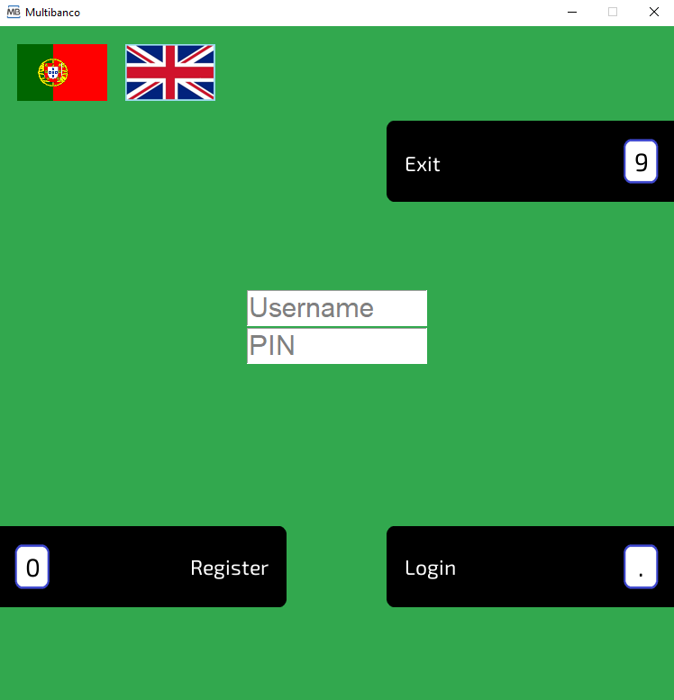
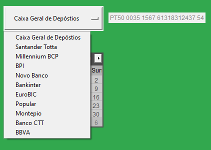
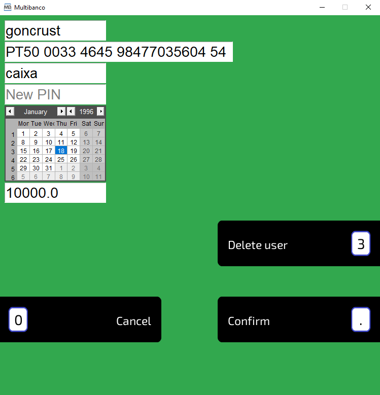

# MBSim

**Portuguese ATM Simulator** for school project

## List of contents

1. [Info](#Info)
1. [Development](#Development)
1. [Features](#Features)
1. [Get Started](#Get-Started)

## Info

The current version of the program is only optimised for Windows 10.

*Default admin password is* `3579`

## Development

This project was developed and is maintained by @goncrust, @teravyte18 and @KingKatana09:

</a>

Honorable mentions for having helped in this project (@DPS777):

</a>

## Features

### Real Banks

The application has a list of real Portuguese banks, with iban generation similar to reality.

### Admin Menu

With an admin menu you can change any user data you want.

### Local Database

SQLite3 is used so that all data relating to users and account movements is stored locally.

### Keyboard support

You can use your keyboard's numpad to navigate through the menus.

## Get Started

### Requirements

- python (3 or above)
- Pillow
- tkcalendar

### Step by step (Windows only)

1. Download the executable from [here](https://github.com/goncrust/MBSim/releases/download/v1.1/mbsim.exe)
1. Simply execute the file and ignore the anti-virus warnings

### or (all platforms)

1. Install [python 3.9](https://www.python.org/ftp/python/3.9.1/python-3.9.1-amd64.exe)
1. Install the required python librarys:
    - `pip install pillow`
    - `pip install tkcalendar`
1. Clone the repo: `git clone https://github.com/goncrust/MBSim.git`
1. Go to the folder created by cloning the repo and run `py main.py`
